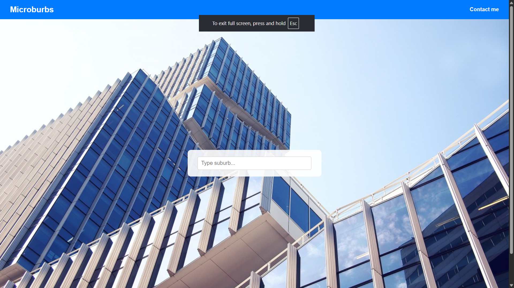
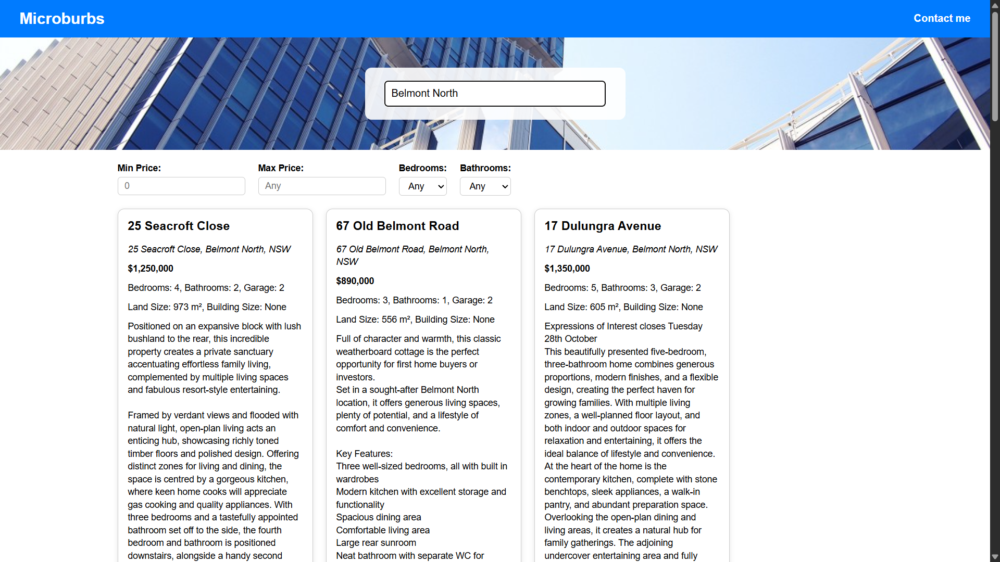

# I can also make this in react or next it was specified as vanilla so i did it :)
# Microburbs Property Explorer

A **Flask-based web application** that allows users to explore Australian residential properties by suburb. The app fetches property data from the Microburbs API, cleans it, and displays it in a **beautiful interactive interface** with filters and tiles.

---

## Features

- Search properties by **suburb** with **debounced input**.
- Dynamic **filters** for:
  - Min/Max Price
  - Bedrooms
  - Bathrooms
- Responsive **tiles view** for property listings.
- Smooth and modern UI for property exploration.

---

## Screenshots

  
  


---

## Requirements

- Python 3.8+
- Flask
- python-dotenv
- requests

---

## Installation & Setup

Follow these steps to run the project locally:

### 1. Clone the repository

```bash
git clone https://github.com/your-username/your-repo.git
cd your-repo/backend

```
### 2. Create virtual environment (recommended)
python -m venv venv

# Activate it
# macOS/Linux
source venv/bin/activate
# Windows
venv\Scripts\activate

### 3. Install dependencies
pip install -r requirements.txt

### 4. Run the app
python app.py

### 5. Goto
localhost:3000/home